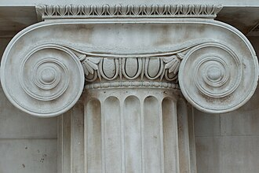
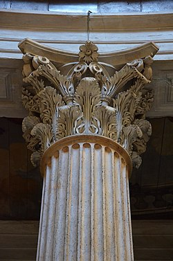

Q: What is the term for the topmost part of a column?
A: The capital.

---

Q: What kind of capital is this?

A: Doric.

---

Q: What kind of capital is this?

A: Ionic.

---

Q: What kind of capital is this?

A: Corinthian.
