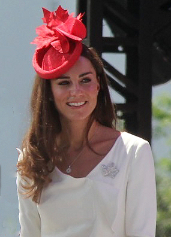

Q: What does SMS stand for?
A: Short Message Service

---

Q: What's the modern alternative to `lxappearance`?
A: `nwg-look`

---

Q: Who was the first documented case of paranoid schizophrenia?
A: James Tilly Matthews

---

Q: Who was James Tilly Matthews?
A: The first documented case of paranoid schizophreina.

---

Q: What was the "air loom"?
A: A delusional belief of James Tilly Matthews.

---

Q: How many minerals are in the PGM group?
A: Six

---

Q: What are the PGM elements?
A: Ruthenium, rhodium, palladium, osmium, iridium, platinum.

---

C: The PGM elements are:

- [ruthenium]
- [rhodium]
- [palladium]
- [osmium]
- [iridium]
- [platinum]

---

Q: ISS, year when the first module was launched.
A: 1998

---

Q: ISS, mass.
A: 450t

---

Q: Space Shuttle, year of first launch.
A: 1981

---

Q: Space Shuttle, year of final launch.
A: 2011

---

Q: Space Shuttle, name of first vehicle to reach space.
A: _Columbia_

---

Q: What is a nitrogen vacancy center?
A: A defect in a diamond lattice where a C-C pair is replaced with N and a lattice vacancy.

---

Q: Soyuz spacecraft, year of first crewed launch.
A: 1967

---

Q: What does OKB-1 stand for?
A: "Experimental Design Bureau-1"

---

Q: Solar irradiance at 1AU.
A: $1361 ~\text{W}/\text{m}^2$

---

Q: Solar irradiance at the Earth's surface.
A: $1000 ~\text{W}/\text{m}^2$

---

Q: Definition of one electronvolt.
A: The amount of energy gained or lost by an electron moving through a $1 ~\text{V}$ voltage in vacuum.

---

C: A proton is around [1800] times more massive than an electron.

---

Q: LHC, year construction started.
A: 1998

---

Q: LHC, year construction ended.
A: 2008

---

Q: LHC, year of first beam.
A: 2008

---

Q: LHC, circumference.
A: $27 ~\text{km}$

---

Q: What was the world's first ICBM?
A: The SS-6.

---

Q: SS-6, designer.
A: Sergei Korolev.

---

Q: Points are a unit of what?
A: Length.

---

Q: What field uses points as a unit of measure?
A: Typography.

---

Q: What is the standard definition of $1 \text{pt}$?
A: $\frac{1}{72}$ of an inch.

---

Q: What's the visual difference between phi and psi?
A: Phi is a circle, psi a U shape.

---

Q: Who was Clarence Madison Dally?
A: The first recorded victim of radiation poisoning.

---

Q: Who was the first recorded victim of radiation poisoning?
A: Clarence Madison Dally.

---

Q: Name of the longest river in Russia.
A: The Lena.

---

Q: What country is Yakutsk in?
A: Russia

---

Q: Name of the river that runs through Yakutsk.
A: The Lena.

---

Q: When did the Khmelnytsky pogrom happen?
A: 1648–1649.

---

C: The Torah is also known as the [Pentateuch].

---

C: The Pentateuch is another name for the [Torah].

---

C: The Torah is the compilation of the first [five] books of the Hebrew Bible.

---

C: The first five books of the Hebrew Bible are collectively known as the [Torah].

---

Q: Define: dybbuk
A: In Jewish mythology, the soul of a deceased person that is said to possess a living host.

---

Q: TeX Gyre equivalent of Times New Roman?
A: TeX Gyre Termes.

---

Q: TeX Gyre sans-serif font?
A: TeX Gyre Heros.

---

C: Hyperthreading is Intel's implementation of [simultaneous multithreading].

---

C: Intel's implementation of simultaneous multithreading is called [hyperthreading].

---

C: Term: [simultaneous multithreading]

Definition: [a technique whereby a single CPU can execute multiple threads in parallel.]

---

Q: Frequency of AC power in Australia.
A: $50~\text{Hz}$.

---

Q: Who wrote _The Unreasonable Effectiveness of Mathematics in the Natural Sciences_?
A: Eugene Wigner.

---

Q: Who wrote _The Nature of the Firm_?
A: Ronald Coase.

---

C: _The Nature of the Firm_ was published in the year [1937].

---

Q: Who wrote _The Use of Knowledge in Society_?
A: Friedrich Hayek.

---

C: _The Use of Knowledge in Society_ was published in the year [1945].

---

Q: What does _more geometrico_ mean?
A: "In a geometric manner".

---

Q: What is "_more geometrico_" an allusion to?
A: Spinoza's _Ethics_.

---

Q: Vernier acuity.
A: The ability of the human visual system to notice misalignment between two parallel line segments.

---

C: Country: [Uzbekistan]

Capital City: [Tashkent]

---

Q: What is Rubin's vase?
A: An optical illusion that can be perceived either as two faces in profile or as a vase.

---

Q: What is the name of the optical illusion depicting two faces or a vase?
A: Rubin's vase.

---

Q: What is a Bernoulli grip?
A: A pneumatic gripping device that uses airflow to lift objects without physical contact.

---

Q: What is this hat-like thing called?

A: A fascinator.

---

Q: Which star is called the "dog star"?
A: Sirius.
